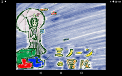

# Umiuni2D 2015y

Umiuni2D is 2d game library executable on flutter and webgl.

http://kyorohiro.github.io/umiuni2d/web/index.html

# Restriction..

Using Flutter API is old in umiuni2d now.

maybe, not working...

## Example & Demo

https://github.com/kyorohiro/umiuni2d_example

## NetBox

https://github.com/kyorohiro/umiuni2d_netbox

## Beacon

https://github.com/kyorohiro/umiuni2d_beacon

## LICENSE

  
   
  To the extent possible under law,
  the person who associated CC0
  with this work has waived all copyright and related or neighboring
  rights to this work.

## VERSION
### 0.0.1
Trial for making mini games.
https://play.google.com/store/apps/details?id=info.kyorohiro.umiuni2d.demo.mino

* tag is "v0.0.1" https://github.com/kyorohiro/umiuni2d/tree/v0.0.1
* example branch is "v0.0.1" too.
https://github.com/kyorohiro/umiuni2d_example/tree/v0.0.1

### 0.0.2 now creating
* animation plus
* scroll view plus
* mod interface
